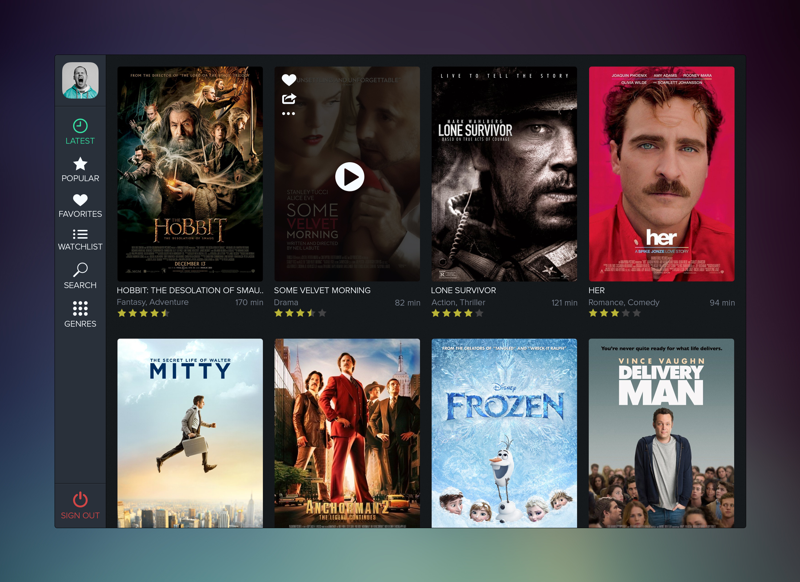

# Angular7-coding-challenge
Angular 7 frontend coding challenge
# Frontend Coding Challenge "Moviestore"

Implement a "movie store" (like blockbusters or Netflix). The store needs to hold a number of movies (let’s say 10 or 15 is sufficient for our testing purposes).
The following [design concept](https://dribbble.com/shots/1316797-Movee-Concept/attachments/184879) deals as example for the basic layout of your moviestore:

_Credits to [Oskar Levinson](https://dribbble.com/levinson)_

## The requirements

In addition to an appealing design and a solid basic architecture, there are the following requirements as key functions to implement:

- We need to see the most popular movies on the start screen.
- We need to be able to search the movie store by their titles.
- We need a watchlist implementation to store movies you'd like to see later. This list should be accessible in a separate view. It is not necessary but desirable that the watchlist is stored locally and is still available after refreshing the page.

## The goals

The solution should have a beautiful and clean code base, without any repetition or hacks. It should be code that you would be proud to have in production.

You can choose any framework or 3rd party libraries you want and which might seem useful for your solution.
You should use the API provided by _The Movie DB_ (https://www.themoviedb.org/documentation/api) as your primary data source.
The required *API key* is: `451a5c46225283a9a3e766eee8fa80ac`

You should be mindful about performance, but it’s not a major concern.

You should not over engineer the solution.

## Inspiration

[Dribbble Search "Movie Store"](https://dribbble.com/search?q=movie+store&s=latest)

[Pinterest Search "Movie Store UI"](https://de.pinterest.com/search/pins/?q=movie%20store%20ui)

Be creative. Be inspiring. Be awesome.
